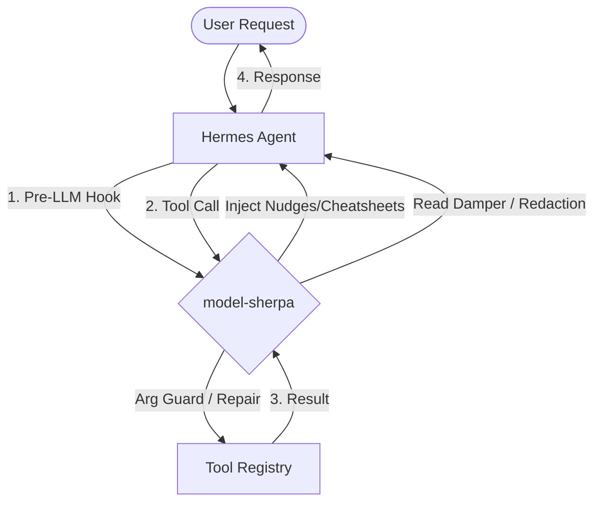

# 🏔️ model-sherpa
> **The ultimate guide-rails and sentinel layer for LLM agents.**

[](https://opensource.org/licenses/MIT)
[](https://www.python.org/downloads/)
[](https://github.com/nousresearch/hermes)

`model-sherpa` is a high-performance, production-grade safety and optimization layer for the Hermes Agent framework. It acts as an intelligent intermediary, monitoring the "hot path" of model-to-tool interactions to prevent hallucinatory loops, optimize context window usage, and enforce strict operational privacy.

---

## 🏗️ System Architecture

Sherpa sits as a transparent middleware between the LLM and the Hermes Tool Registry. It intercepts every hook to apply heuristic and schema-based corrections.



---

## 🚀 Key Guide-Rails

### 🛡️ Arg Guard & Universal Repair
The **Arg Guard** is your first line of defense against model "fumbles."
- **Schema Validation**: Intercepts tool calls and validates them against their JSON schema before execution.
- **Smart-Quote Repair**: Automatically converts curly quotes (`“path.txt”`) to standard ASCII, fixing a common LLM copy-paste error.
- **Fuzzy Normalization**: Maps hallucinatory keys (e.g., `file_path` or `file-path`) to the canonical schema key (`path`) automatically.
- **`patch` Specialist**: Dedicated repair logic for the `patch` tool, mapping `diff` or `original` to `patch_string`.

### 🕵️ Sequence Loop Detection (SLD)
Standard repetition counters miss the most expensive failure mode: **Rhythmic Thrashing**. Sherpa detects:
- **Simple Repeats**: $A \rightarrow A \rightarrow A$
- **Ping-Pong Loops**: $A \rightarrow B \rightarrow A \rightarrow B$
- **Complex Cycles**: $A \rightarrow B \rightarrow C \rightarrow A \rightarrow B \rightarrow C$
When detected, Sherpa injects a "Loop Nudge" into the model's context, forcing it to pivot strategy before it burns through the token budget.

### 📉 Smart Read Range Damping
Traditional dampers block the same file twice. Sherpa's **Read Damper** is range-aware:
- **Paging Support**: Allows the model to page through a file sequentially (e.g., Lines 1-100, then 101-200).
- **Subset Detection**: Blocks a read only if the requested lines are **already contained** within a previously read range in the same turn.

### 🔐 Zero-Trust Telemetry
Sherpa is built for privacy-conscious environments:
- **Substring Redaction**: Masks `api_key`, `token`, `password`, and `secret` in all logs, even if they are part of a larger key (e.g., `github_token_v2`).
- **Binary Safeguards**: Automatically summarizes non-UTF8 data (`<binary data: 1.2MB>`) to prevent context window pollution.

---

## ⌨️ Slash Commands

| Command | Description |
| :--- | :--- |
| `/sherpa status` | Comprehensive dashboard of lifetime stats and feature states. |
| `/sherpa feature <name> <on/off>` | Real-time toggle for any guide-rail (e.g., `loop_detector`, `read_damper`). |
| `/sherpa doctor` | Runs a diagnostic check on your tool registry to find schema inconsistencies. |
| `/sherpa telemetry` | View the most recent session events with full redaction. |
| `/sherpa add hint <regex> <message>` | Dynamically add new recovery hints without restarting. |

---

## 🛠️ Advanced Configuration

### Custom Hints Engine
You can extend Sherpa's recovery logic via the `custom_hints` array in `state.json`. These are matched using a high-performance, cached regex engine.

```json
{
  "custom_hints": [
    {
      "pattern": "Permission denied",
      "hint": "Tip: You are in a restricted directory. Try using your home folder or sudo."
    }
  ]
}
```

---

## ⚡ Engineering & Performance
- **Atomic Transactions**: Uses `fcntl` cross-process locking and atomic `replace()` to ensure state integrity across multiple Hermes instances.
- **Minimal Latency**: Implements multi-level caching for disk stats and regex patterns. Post-tool hooks are benchmarked to add < 1ms of overhead.
- **Startup Stability**: Uses non-blocking locks to ensure the CLI never hangs, even if the state file is contested.

---

## 🛠️ Development

This plugin ships with a smoke test suite and a `Makefile` for quick local checks.

```bash
# Static analysis (catches undefined names, missing globals, etc.)
make lint

# Run the 26 pytest smoke tests (hook happy paths, regression tests
# for the bug fixes, feature coverage).
make test

# Both, in order.
make check
```

The `make lint` target runs `pyflakes` against `__init__.py` — the same
static analysis that uncovered four of the five critical bugs in the
v0.3.0 review. It is strongly recommended to run `make lint` before opening a PR.

Tests live in `tests/test_smoke.py` and use a temporary `HERMES_HOME`
so they never touch the real user's state. They cover:

- The five regression bugs from the v0.3.0 review
- Loop detection end-to-end (`_post_tool_call` → `_queue_nudge`)
- Smart-quote repair and arg-name alias repair
- `command_lint` ($ prompt strip, `cd` extraction)
- `arg_guard` (empty required args)
- Per-tool stat key collision safety (Issue #11)
- Fingerprint cycle / depth-cap safety (Issue #10)
- Concurrency and lock retry safety on state lock file
- Cross-process log rotation safety for corrections and events logs
- Background daemon thread/timer leak prevention for cleanup and periodic flush tasks
- Stale session cleanup start/restart safety on session initialization
- Candidate scanning limits in `_didyoumean_path` to optimize latency
- `__version__` consistency

---

## 📜 License
MIT License.
